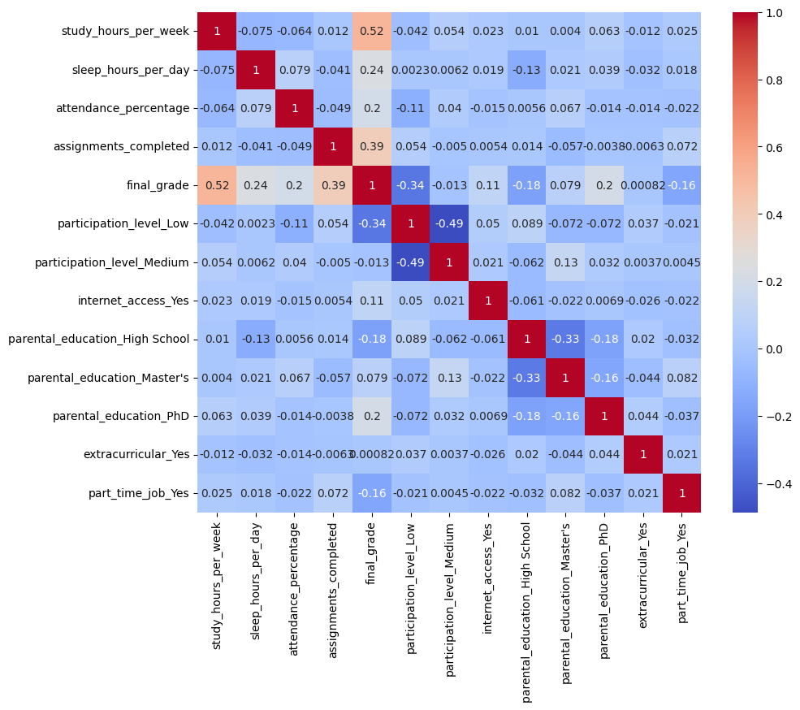
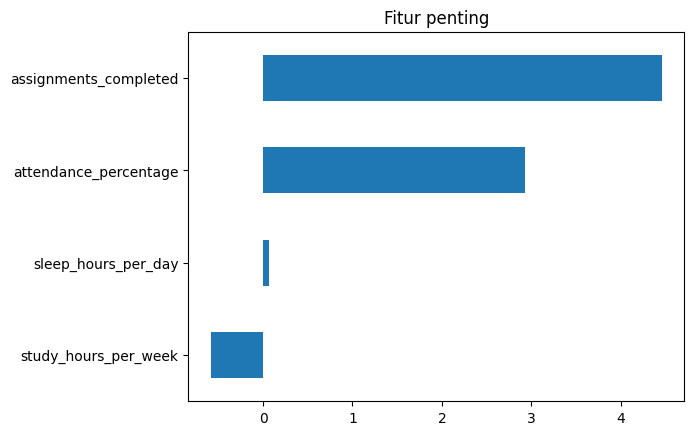
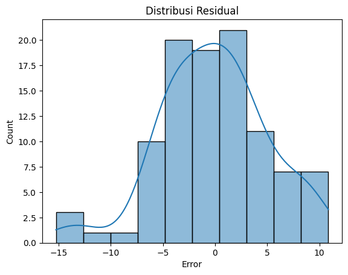

# 📚 Student Study Habits & Academic Performance Prediction

  

> **"Bagaimana kebiasaan belajar mempengaruhi nilai akhir siswa?"**  
> Proyek ini menggunakan regresi dengan teknik ML untuk memprediksi nilai akhir siswa berdasarkan kebiasaan belajar seperti jam tidur, kehadiran, penyelesaian tugas, dan lainnya.

---

## 🔗 Dataset
Dataset sintetis ini berasal dari Kaggle:  
📎 [Student Study Habits Dataset by Preksha Dand](https://www.kaggle.com/datasets/prekshad2166/student-study-habits?select=student_study_habits.csv)  
📊 500 siswa | 13 fitur kebiasaan belajar | Target: final_grade

---

## 🎯 Tujuan Proyek
- Menemukan fitur kebiasaan belajar yang paling mempengaruhi nilai akhir
- Melatih dan mengevaluasi model regresi (Lasso)
- Menganalisis residual dan distribusi error

---

## 🛠️ Metode yang Digunakan
- Exploratory Data Analysis (EDA)
- Visualisasi korelasi dan distribusi
- Standardisasi data
- Model Regresi Lasso + GridSearchCV
- Evaluasi: MAE, MSE, R², Explained Variance
- Analisis Residual & Feature Importance

---

## 📈 Visualisasi

### 🔍 Korelasi Fitur


### 📊 Fitur Paling Berpengaruh


### 🧪 Distribusi Error Model (Residual)


---

## 🧠 Insight Penting
- 🥇 **Tugas yang diselesaikan (`assignments_completed`)** adalah indikator terkuat terhadap nilai akhir
- 🥈 **Kehadiran (`attendance_percentage`)** juga sangat berpengaruh
- 😴 **Waktu tidur dan waktu belajar** memiliki korelasi rendah dalam prediksi nilai
- 🔁 Residual terdistribusi normal → model cukup stabil

---

## 🧪 Hasil Evaluasi Model Lasso (Final)

| Metrik                     | Nilai         |
|---------------------------|---------------|
| Explained Variance Score  | **0.535**     |
| Mean Absolute Error (MAE) | **4.00**      |
| Mean Squared Error (MSE)  | **26.24**     |
| R² Score                  | **0.534**     |

---

## 📁 Struktur Proyek
Student-Study-Habits/ <br>
├── Student_Study_Habits.ipynb <br>
├── README.md <br> 
├── requirements.txt <br>
├── data/ <br>
│ └── student_study_habits.csv <br>
├── images/ <br>
│ ├── correlation_matrix.png <br>
│ ├── fitur_penting.png <br>
│ └── residual_plot.png <br>


---

## 🚀 Cara Menjalankan Proyek

### 1. Clone repository

```bash
git clone https://github.com/username/Student-Study-Habits.git
```
```bash
cd Student-Study-Habits
```

### 2. Install dependencies
```bash
pip install -r requirements.txt
```
---

## 📌 Dependencies
- numpy
- pandas
- matplotlib
- seaborn
- scikit-learn

---

### 📬 Kontak & Kredit
👨‍💻 Author: Hidayat Bakri <br>
📧 Email: [hidayat**@gmail.com] <br>
📎 Dataset: Kaggle: Student Study Habits <br>
